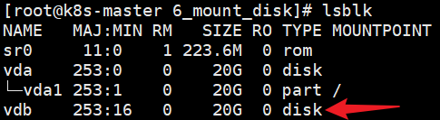
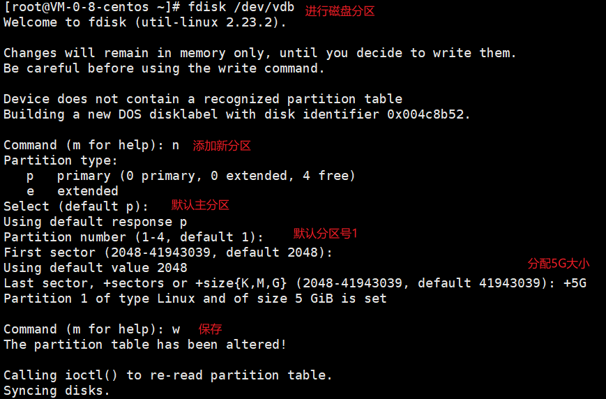
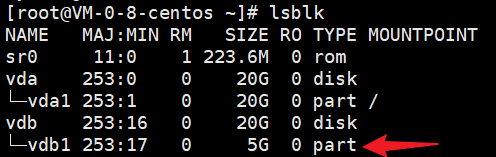
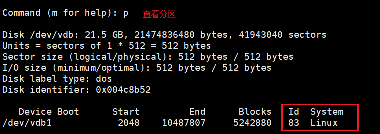
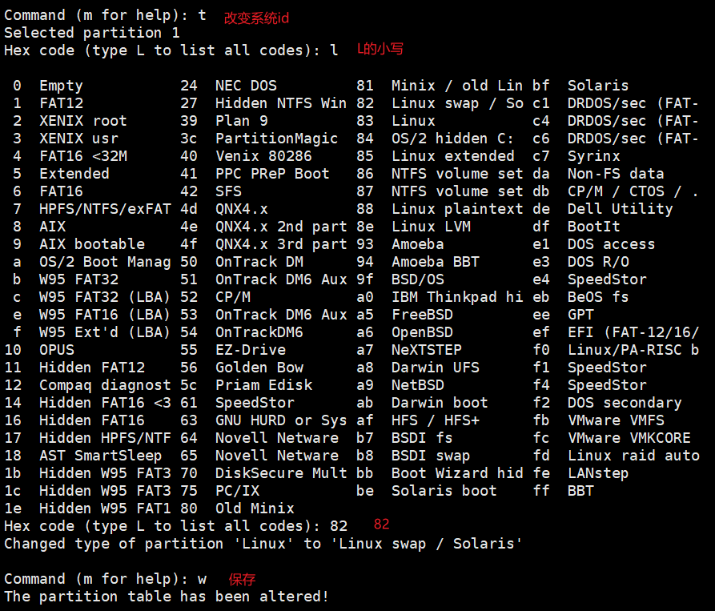
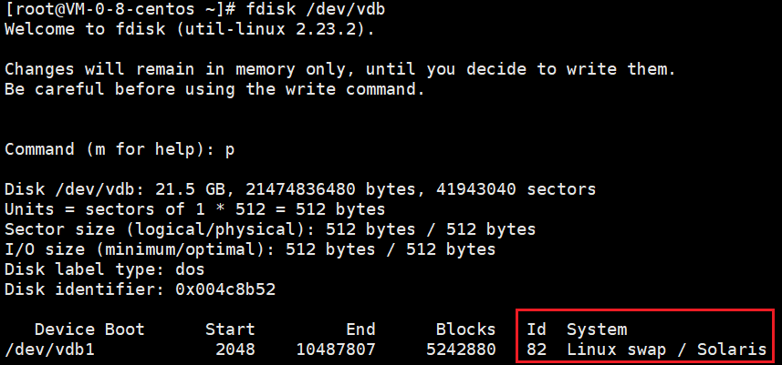
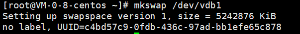
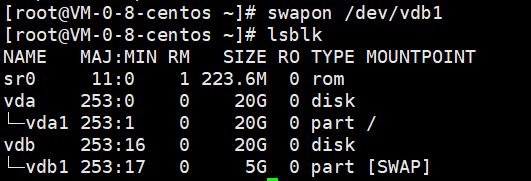
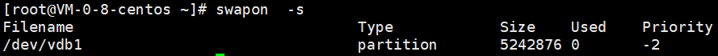

> 当物理内存不够，就把该分区当做`虚拟内存`来使用
>
> 案例：
>
> 把 vdb 进行分区, vdb1瓜分5G作为交换分区使用 

## 磁盘分区

查看物理磁盘：`lsblk`

	

进行分区：`fdisk /dev/vdb`

	

再次查看物理磁盘

	

查看分区类型

	

修改分区类型

	

再次查看分区类型

		

## 格式化分区

`mkswap /dev/vdb1` 

	

## swap挂载

永久挂载：

```sh
vim /etc/fstab
------------------------------------
UUID=c4bd57c9-0fdb-436c-97ad-bb1efe65c878  swap  swap  defaults  0  0
------------------------------------
```

临时挂载：`swapon /dev/vdb1`

	

查看挂载：`swapon -s`

	

删除挂载：`swapoff /dev/vdb1` 

	