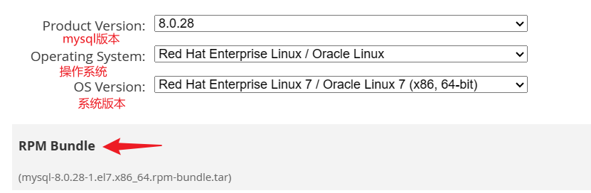

## 卸载mariadb

列出安装的mariadb rpm 包

```sh
rpm -qa | grep mariadb
```

卸载

```
rpm -e --nodeps mariadb-libs
```

## 下载 MySQL rpm包

下载地址：https://downloads.mysql.com/archives/community/

	

## 安装MySQL

查看当前包

```sh
> ls
mysql-8.0.28-1.el7.x86_64.rpm-bundle.tar
```

解压

```sh
> tar -xvf mysql-8.0.28-1.el7.x86_64.rpm-bundle.tar 
mysql-community-client-8.0.28-1.el7.x86_64.rpm
mysql-community-client-plugins-8.0.28-1.el7.x86_64.rpm
mysql-community-common-8.0.28-1.el7.x86_64.rpm
mysql-community-devel-8.0.28-1.el7.x86_64.rpm
mysql-community-embedded-compat-8.0.28-1.el7.x86_64.rpm
mysql-community-icu-data-files-8.0.28-1.el7.x86_64.rpm
mysql-community-libs-8.0.28-1.el7.x86_64.rpm
mysql-community-libs-compat-8.0.28-1.el7.x86_64.rpm
mysql-community-server-8.0.28-1.el7.x86_64.rpm
mysql-community-test-8.0.28-1.el7.x86_64.rpm
```

安装

```sh
rpm -ivh mysql-community-client-plugins-8.0*.rpm
rpm -ivh mysql-community-common-8.0*.rpm
rpm -ivh mysql-community-libs-8.0*.rpm
rpm -ivh mysql-community-client-8.0*.rpm
rpm -ivh mysql-community-icu-data-files-8.0*.rpm
```

```sh
rpm -ivh mysql-community-server-8.0*.rpm
----------------------------------------
# 安装报错: 
warning: mysql-community-server-8.0.28-1.el7.x86_64.rpm: Header V4 RSA/SHA256 Signature, key ID 3a79bd29: NOKEY
error: Failed dependencies:
	libnuma.so.1()(64bit) is needed by mysql-community-server-8.0.28-1.el7.x86_64
	libnuma.so.1(libnuma_1.1)(64bit) is needed by mysql-community-server-8.0.28-1.el7.x86_64
	libnuma.so.1(libnuma_1.2)(64bit) is needed by mysql-community-server-8.0.28-1.el7.x86_64
----------------------------------------
# 安装依赖
yum install numactl -y
# 再次执行
rpm -ivh mysql-community-server-8.0*.rpm
```

## 其他操作

参考Yum安装MySQL文档步骤：[转跳点我](https://zwxzxz.github.io/posts/yum%E5%AE%89%E8%A3%85mysql/#%E5%90%AF%E5%8A%A8mysql)

