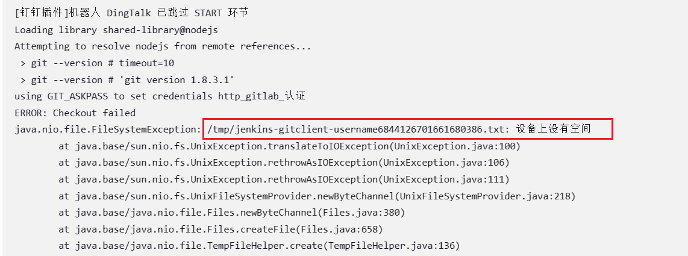
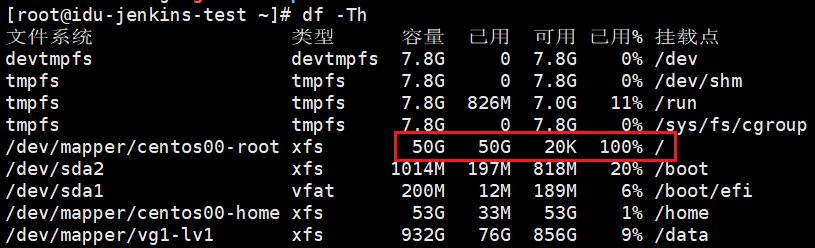
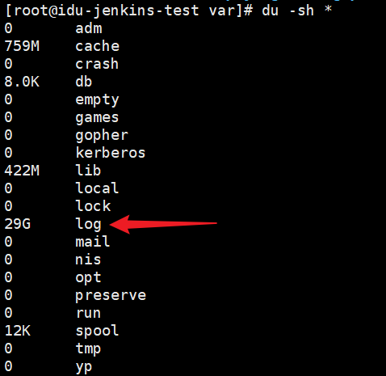
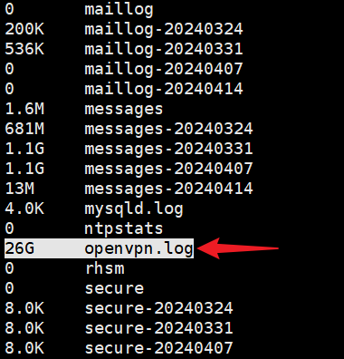

# 日志导致磁盘爆满

1. Jenkins打包报错

   	

2. 由于Jenkins数据在data目录下，但/目录占用100%，所以怀疑是日志占用

   	

3. 寻找占用大的目录

   

   果然，log占用29G，openvpn.log占用26G

   	

5. 删除文件

   ```sh
   # 删除文件时，建议使用 cat /dev/null > 方式进行删除，不建议使用 rm。使用 rm 方式删除的文件，可能不能被对应服务进程释放掉，该文件所占用的空间也就不会被释放。
   > cat /dev/null > openvpn.log
   ```

- ``标签添加图片

- `alt`属性 - 这里图片链接错误，图片无法载入，所以显示了`alt`属性的文本

- `height、width`属性 - 指定宽高为150

- `<div>` 标签的`align`属性 - 使图片和文本居中，左对齐`left`，右对齐`right`
<div align=center>

<br>摩托车图片</div>

- 下图是居中显示-图片默认插入方式

- 下图是左对齐显示

- 下图是右对齐显示


